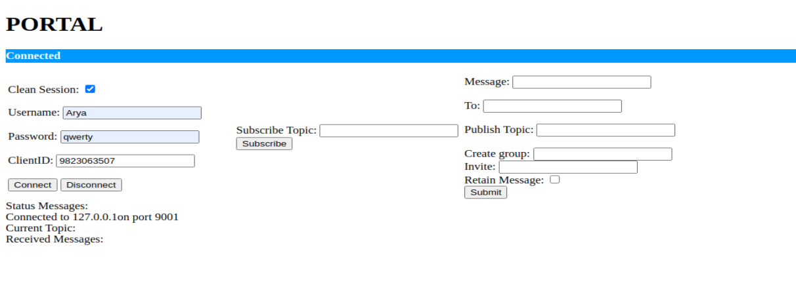

# PORTAL

Client: HTML Client

Broker: mosquitto-2.0.11 (changes made in the .conf file which are provided in the main repo and added a password_file pw.txt)

Server: Server side using Python and paho.mqtt.java-master

